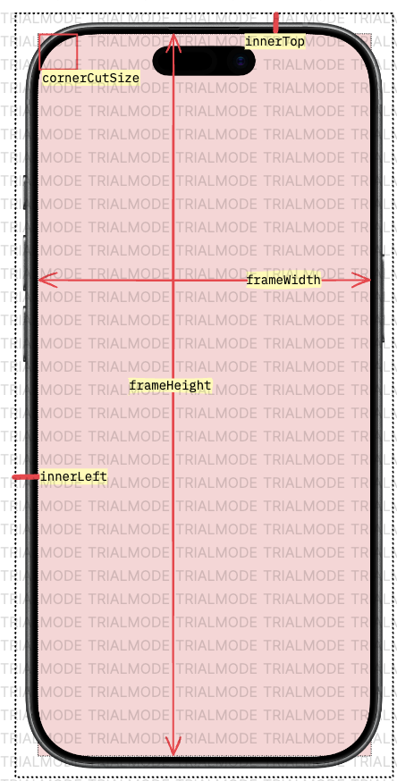

# Device frame

Adds a device frame to simulator screenshots in a directory in portrait and landscape orientation.

Currently supports many different iPhones and iPads and the Google Pixel 5. See for all supported devices the [device-frame.json](./src/device-frame.json) file.

## Getting started

Install with:

`npm i -g @michielvaneerd/device-frame`

Download the device frames from the following locations:

- https://design.facebook.com/toolsandresources/devices/
- https://developer.apple.com/design/resources/#product-bezels

Unzip them and place them somewhere on your system. Now you have something like:

```shell
~/Meta Devices/Phones/Apple iPhone 14 Pro Max/Device/iPhone 14 Pro Max – Space Black.png
~/Meta Devices/Phones/Google Pixel 5/Device/Google Pixel 5 Just Black.png
~/Meta Devices/Tablets/Apple iPad Air 2020/Device/Apple iPad Air 2020 Space Gray Portrait.png
~/Apple Devices/iPad mini - Starlight - Portrait.png
```

The [device-frame.json](./src/device-frame.json) file expects the device frames in a specific location. If you have a different setup, alter this file accordingly.

## Validating your frames

This will check if all frames defined in device-frame.json are available on yor system:

```shell
device-frame validate
```

## Calling the script

Add frames to all iOS simulator screenshots in the `~/screens` directory and put them in the `~/destination` directory:

```shell
device-frame ios ~/screens ~/destination
```

Add frames to all Android simulator screenshots in the `~/screens` directory and put them in the `~/destination` directory:

```shell
device-frame android ~/screens ~/destination
```

## Adding new devices

Devices are defined in the [device-frame.json](./src/device-frame.json) file.
If you want to add a device, copy this file to `~/device-frame.json` and add the entry there. The script will first look for this file and then for the default one and merge the two with your copied file prioritized.

```json
{
    "1488x2266": {
        "frameWidth": 1780,
        "frameHeight": 2550,
        "screenShotWidth": 1488,
        "screenShotHeight": 2266,
        "innerLeft": 146,
        "innerTop": 142,
        "innerWidth": 1488,
        "innerHeight": 2266,
        "cornerCutSize": 0,
        "path": "~/Apple Devices/iPad mini - Starlight - Portrait.png",
        "inch": 11,
        "devices": [
            "iPad mini (6th generation)"
        ],
        "download": [
            "https://developer.apple.com/design/resources/#product-bezels",
            "https://devimages-cdn.apple.com/design/resources/download/Bezel-iPad-mini.dmg"
        ]
    },
}
```

The key of a device is the `width`x`height` in pixels of the simulator screenshot. For example screenshots of the iPhone 14 Pro Max device are 1290x2796 pixels, so this is the key. The other fields:

- `frameWidth` and `frameHeight` - Width and height of the device frame image.
- `screenShotWidth` and `screenShotHeight` - Width and height of the simulator screenshot images, so this will be the same as the key of this device.
- `innerLeft` and `innerTop` - The left and top position of the start of the inner frame - this is where the simulator screenshot should be placed.
- `innerWidth` and `innerHeight` - The width and height of the inner frame - this is the size that is available for the simulator screenshot.
- `cornerCutSize` - The width and height of the square in the 4 corners that should be cut out (made transparent). If this is not needed, specify 0 (zero).
- `path` - Path of the frame image.
- `inch` - Not used in this script, just for informational purposes.
- `devices` - Not used in this script, just for informational purposes.
- `download` - Not used in this script, just for informational purposes.



## Other resources

- Official Apple downloads: https://developer.apple.com/design/resources/#product-bezels
- Apple device dimensions: https://developer.apple.com/help/app-store-connect/reference/screenshot-specifications/
- Official add Android device frames to your screenshots: https://developer.android.com/distribute/marketing-tools/device-art-generator